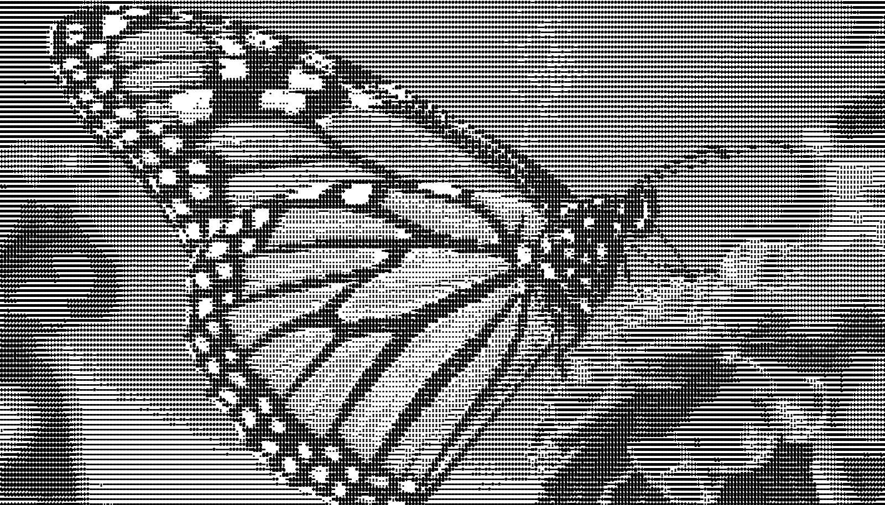
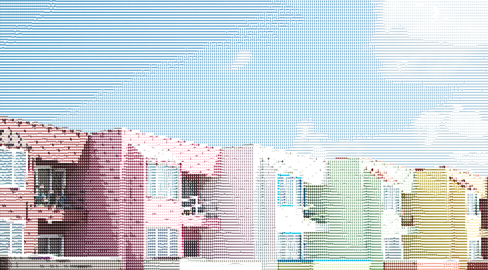
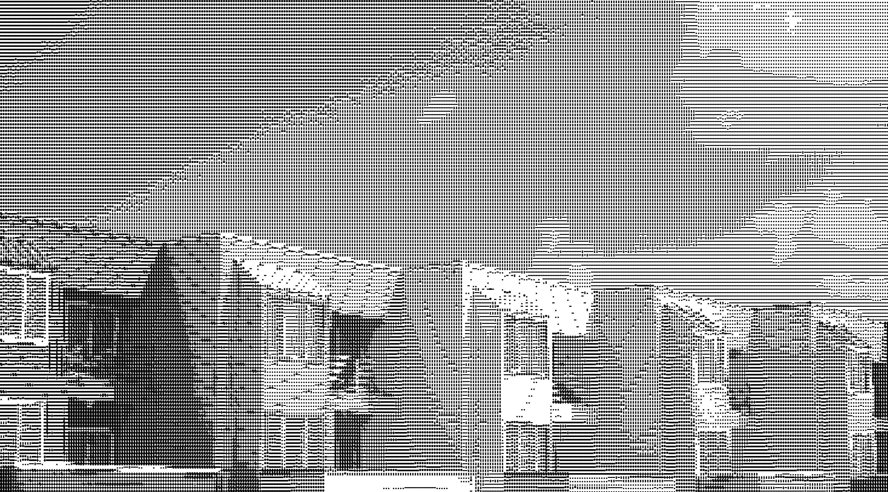

# ASCII Video Converter

Convert Video and Images to ASCII form! Achieve Real-Time Color ASCII Rendering using NumPy Vectorization.

See this algorithm work on a webcam stream: https://github.com/AlexEidt/ASCII-Vision

## Usage

```
positional arguments:
  filename      File name of the input image.
  output        File name of the output image.

optional arguments:
  -h, --help    show this help message and exit
  -chars CHARS  ASCII chars to use in media.
  -f [F]        Font size.
  -b [B]        Boldness of characters. Recommended boldness is 1/10 of Font size.
  -bg [BG]      Background color. Must be either 255 for white or 0 for black.
  -m M          Color to use for Monochromatic characters in "R,G,B" format.
  -c            Clip characters to not go outside of image bounds.
  -font [FONT]  Font to use.
  -a            Add audio from the input file to the output file.
```

## Dependencies

* Python 3.7+
* `imageio`
* `imageio-ffmpeg`
* `numpy`
* `PIL`
* `tqdm`

```
pip install numpy pillow tqdm imageio imageio-ffmpeg
```

# Images










# Video


