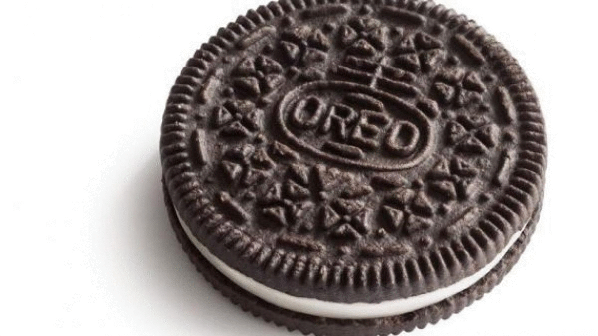

# ASCII Video Converter

Convert Video and Images to ASCII form! An efficient ASCII drawing algorithm allows for ~10 FPS ASCII conversion.

## Usage

```
usage: ascii.py [-optional args] filename output

Blazing fast ASCII Media converter.

positional arguments:
  filename          File name of the input image.
  output            File name of the output image.

optional arguments:
  -h, --help        show this help message and exit
  -chars            ASCII chars to use in media.
  -f                Font size.
  -b                Boldness of characters. Recommended boldness is 1/10 of Font size.
  -d                Use normal drawing algorithm over efficient one.
  -m                Color to use for Monochromatic characters in "R,G,B" format.
  -c                Clip characters to not go outside of image bounds.
  -r                Draw random ASCII characters.
  -height           Height of random ASCII media.
  -width            Width of random ASCII media.
  -cores            CPU Cores to use when processing images.
  -fps              Frames per second of randomized video (For use with random only).
  -dur              Duration (in seconds) of randomized video (For use with random only).
```

## Dependencies

* Python 3.7+
* `imageio`
* `numpy`
* `PIL`
* `tqdm`

```
pip install numpy pillow tqdm imageio
pip install imageio-ffmpeg --user
```


# Images

### Butterfly


### Oreo



<br /><br />

# Video

### Original


### Color


### Monochrome


<br /><br />

# Random


